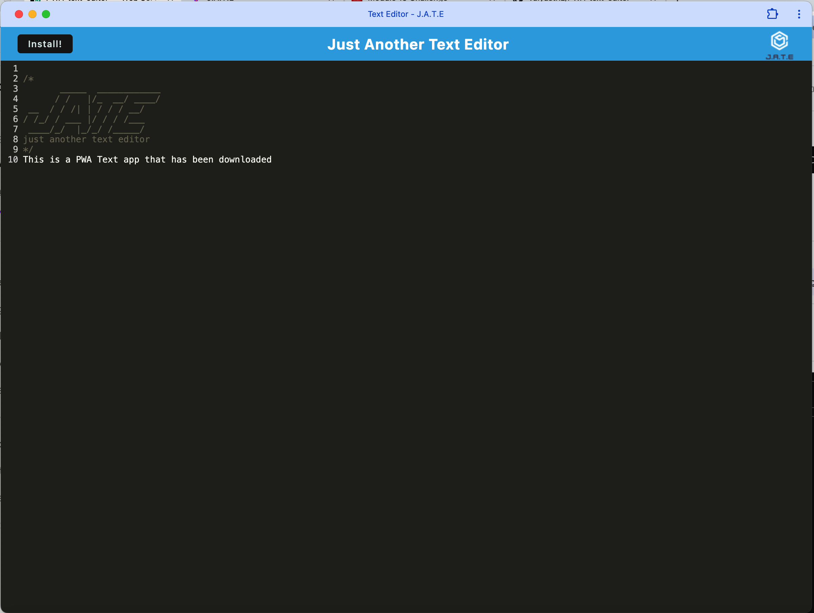
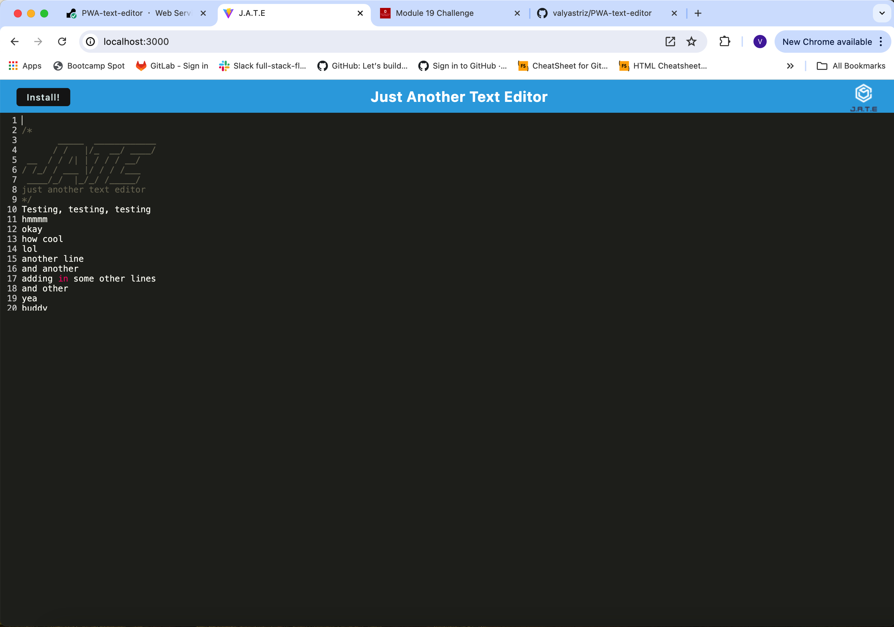

# PWA Text Editor

## Description
This is a Progressive Web Application (PWA) that functions as a text editor. It allows users to create notes or code snippets with or without an internet connection. The application uses various data persistence techniques to ensure that data is saved reliably and is available offline.

## Deployed Application
You can access the deployed application at the following URL:  
[Live Site](https://pwa-text-editor-8wzr.onrender.com)

## GitHub Repository
You can access the GitHub repository at the following URL:  
[GitHub Repo](https://github.com/valyastriz/PWA-text-editor.git)

## Application Features
- Runs in the browser as a single-page application
- IndexedDB is used for data storage, allowing content to persist even without an internet connection
- The content is saved automatically when the DOM window is unfocused
- The application can be installed as a PWA
- A service worker is registered to cache assets and ensure offline functionality

## Screenshots
  


## Installation
1. Clone the repository from GitHub:
   ```
   git clone https://github.com/valyastriz/PWA-text-editor.git
   ```
2. Navigate into the project directory:
   ```
   cd PWA-text-editor
   ```
3. Install the necessary dependencies:
   ```
   npm install
   cd client && npm install
   ```
4. Run the application in development mode:
   ```
   npm run start:dev
   ```
5. To build for production:
   ```
   npm run build
   ```

## Usage
- Open the application in your browser, and you can start creating or editing text.
- The app will save content in IndexedDB and automatically restore it when you return to the site.
- You can also install the PWA on your device using the "Install" button.

## Technologies Used
- JavaScript
- Node.js
- Express.js
- Webpack
- IndexedDB
- Workbox (for service worker)

## Deployment
The application is deployed using Render.

## License
This project does not have a license.
